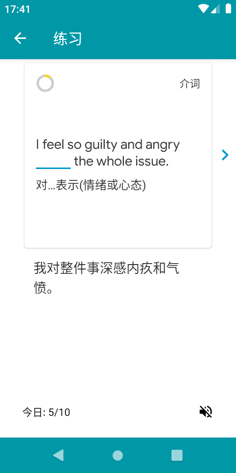

# Light Word Android

<br/>

## Make vocabulary csv file
Vocabulary csv document composition: 

You can look up word frequency from [COCA](https://corpus.byu.edu/coca/).
```
vocabulary, word frequency, json
abandon,11338,{"pronounce": ["əbændən", "əˈbændən"], "inflection": ["abandoning"..... 
ability,107124,{"pronounce": ["əbɪlɪti", "əˈbɪləti"], "inflection": ["ability"......
```
Json Data Structure
```
{
    "pronounce": [
        "əbændən",
        "əˈbændən"
    ],
    "inflection": [
        "abandoning",
        "abandons",
        "abandoned",
        "abandon"
    ],
    "source": "Collins",
    "collocation": [
        {
            "meaning": "离弃；遗弃；抛弃",
            "part of speech": "动词",
            "examplelist": [
                {
                    "example": "He claimed that his parents had abandoned him.",
                    "translation": "他声称父母遗弃了他。"
                },
                {
                    "example": "The road is strewn with abandoned vehicles. ",
                    "translation": "道路上满是弃置的车辆。"
                }
            ]
        },
        {
            "meaning": "中途放弃，中止(活动、工作等)",
            "part of speech": "动词",
            "examplelist": [
                {
                    "example": "The authorities have abandoned any attempt to distribute food.",
                    "translation": "当局中止了分发食物的尝试。"
                },
                {
                    "example": "The scheme's investors, fearful of bankruptcy, decided to abandon the project. ",
                    "translation": "因为担心破产，该计划的投资者决定放弃这个项目。"
                }
            ]
        },
        {
            "meaning": "放弃(想法或思路)",
            "part of speech": "动词",
            "examplelist": [
                {
                    "example": "Logic had prevailed and he had abandoned the idea. ",
                    "translation": "最终理智占了上风，他打消了那个念头。"
                }
            ]
        }
    ]
}
```

## Screenshot

